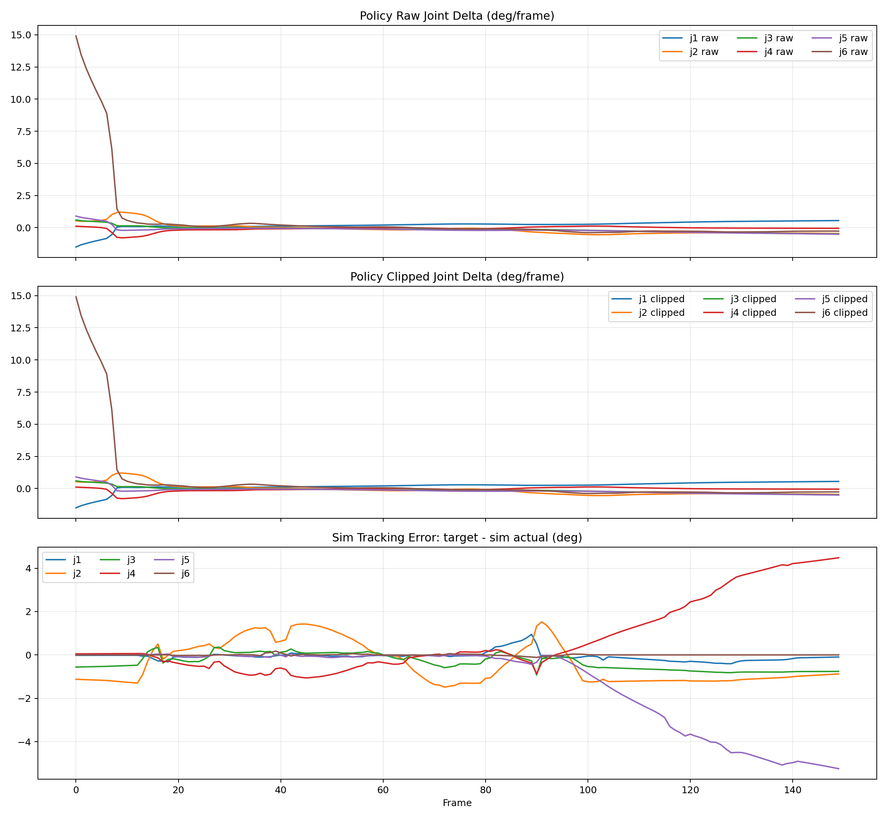
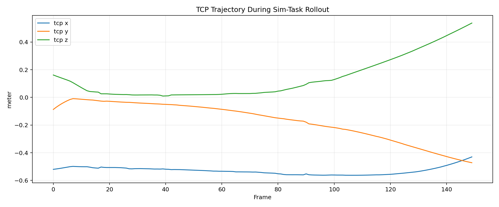
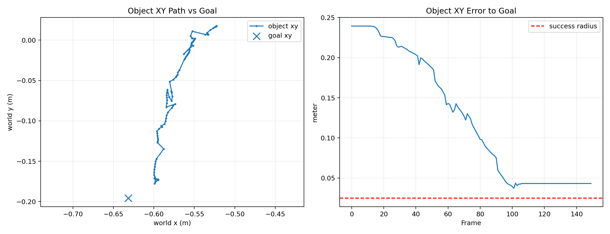

# BC 策略闭环测试分析记录

记录时间：2026-05-13 17:59:13 CST  
实验对象：FR5 单相机行为克隆策略  
策略模型：`demo/fr5_demo/data/il_policies/fr5_bc_last.pt`  
训练记录：`demo/fr5_demo/data/il_policies/fr5_bc_last.history.json`  
测试日志：`demo/fr5_demo/data/policy_rollouts/simtask_fr5_bc_last_20260513_175114.npz`  
测试元数据：`demo/fr5_demo/data/policy_rollouts/simtask_fr5_bc_last_20260513_175114.json`

## 实验设置

本次实验采用已训练的 BC 策略 `fr5_bc_last.pt` 进行闭环仿真测试。模型输入为单相机 RGB 图像、机械臂 6 轴关节角和夹爪闭合度，输出为 6 轴关节增量和夹爪增量。测试任务为随机初始化胶带位置，并使策略在仿真环境中自主完成“胶带套入 `myd_part1`”任务。

测试命令如下：

```bash
uv run python demo/fr5_demo/fr5_policy_rollout.py \
  --policy demo/fr5_demo/data/il_policies/fr5_bc_last.pt \
  --sim-task-rollout \
  --max-steps 150 \
  --hz 10 \
  --log-every 1
```

该测试不依赖某一条专家 episode 回放，而是将策略直接放入随机初始化的任务环境中进行闭环执行，因此更接近真实部署场景。

## 实验结果

本次闭环测试未完成任务，最终胶带中心与目标点的水平距离为 `0.0432 m`，大于设定成功半径 `0.025 m`。

| 指标 | 数值 |
|---|---:|
| 测试帧数 | 150 |
| 任务成功 | False |
| 最终 XY 误差 | 0.0432 m |
| 成功半径 | 0.0250 m |
| 动作限幅比例 | 0.0000 |
| 最小 TCP 高度 | 0.0098 m |
| 最大 TCP 单步位移 | 0.0180 m |

目标物体位置如下：

| 项目 | 数值 |
|---|---|
| 胶带初始位置 | `[-0.522658, 0.017364, 0.020000]` |
| 目标位置 | `[-0.631700, -0.195700, -0.010000]` |
| 胶带最终位置 | `[-0.594874, -0.173034, 0.109593]` |

## 图像分析

### 策略动作与仿真跟踪误差



图中上两幅分别为策略原始关节增量和限幅后的关节增量，单位为 `deg/frame`。两者基本重合，且日志中 `clip_fraction = 0.0`，说明本次失败不是由动作限幅造成的。策略在初期输出了较大的 `j6` 旋转动作，最大约 `14.9 deg/frame`，符合示教中“先旋转夹爪”的动作模式。

第三幅图为仿真关节跟踪误差，即：

```text
target joint - simulated actual joint
```

其中 `j4` 和 `j5` 在后半段出现明显偏差，最大误差分别约为 `4.48 deg` 和 `5.25 deg`。这表明策略目标关节与仿真实际关节之间存在较大的执行误差，尤其集中在腕部关节。

### TCP 轨迹



TCP 轨迹显示末端在闭环执行过程中存在较大高度变化，最低高度约为 `0.0098 m`。该现象与观察到的“机械臂瘫缩”表现一致，说明问题不仅体现在策略输出，也体现在仿真动力学执行阶段。

### 物体轨迹与目标误差



物体最终未进入成功半径。最终水平误差为 `0.0432 m`，大于成功判定阈值 `0.025 m`，因此本次闭环任务失败。

## 讨论

从实验结果看，本次失败不能简单归因于策略动作被限幅。相反，策略输出在当前阈值下未被截断，说明动作限幅问题已经基本排除。更主要的异常出现在仿真执行阶段：腕部关节 `j4/j5` 的目标-实际跟踪误差逐渐增大，最大达到 4 至 5 度左右。

当前 MJCF 中相关执行器参数为：

```xml
<position name="j4_pos" joint="j4" kp="1800" kv="180" forcerange="-180 180" />
<position name="j5_pos" joint="j5" kp="1500" kv="180" forcerange="-120 120" />
<position name="j6_pos" joint="j6" kp="1500" kv="180" forcerange="-100 100" />
```

由于误差主要集中在 `j4/j5`，后续应重点检查腕部位置控制刚度、阻尼、力矩上限以及末端接触对仿真动力学的影响。

此外，闭环测试比 episode 验证更困难。episode 验证使用专家轨迹图像，而本测试中观测来自策略自身造成的环境状态。因此该实验也暴露了 BC 策略在闭环执行时的分布偏移问题。

## 结论

本次闭环测试表明，`fr5_bc_last.pt` 已经学习到任务初期的夹爪旋转动作，但尚不能稳定完成胶带套入任务。失败原因主要包括两方面：

1. 仿真中 `j4/j5` 腕部关节存在明显目标-实际跟踪误差；
2. BC 策略在随机初始化环境下的闭环纠偏能力不足。

因此，后续不能仅依赖训练/验证 loss 判断模型性能，应同时报告策略输出、动作限幅、仿真跟踪误差、TCP 轨迹和任务成功率。

## 下一步工作

1. 进行腕部执行器参数对比实验。优先测试提高 `j4/j5` 的 `forcerange`，例如：

```xml
<position name="j4_pos" ... forcerange="-240 240" />
<position name="j5_pos" ... forcerange="-180 180" />
```

2. 若跟踪误差仍然较大，再尝试提高 `j5_pos` 的 `kp`，例如从 `1500` 提高到 `1800`。

3. 每次修改后运行相同闭环测试，并比较：

- `max_sim_tracking_error_deg`
- `min_tcp_z_m`
- `place_error_xy_m`
- `task_success`

4. 若仿真跟踪误差改善后任务仍失败，则说明主要瓶颈转向策略泛化能力，应增加随机初始化数据、增加中后段纠偏示教，或引入多帧历史输入。

5. 毕设实验中建议将该测试作为“闭环泛化测试”，与 episode 验证和训练 loss 分开汇报。

